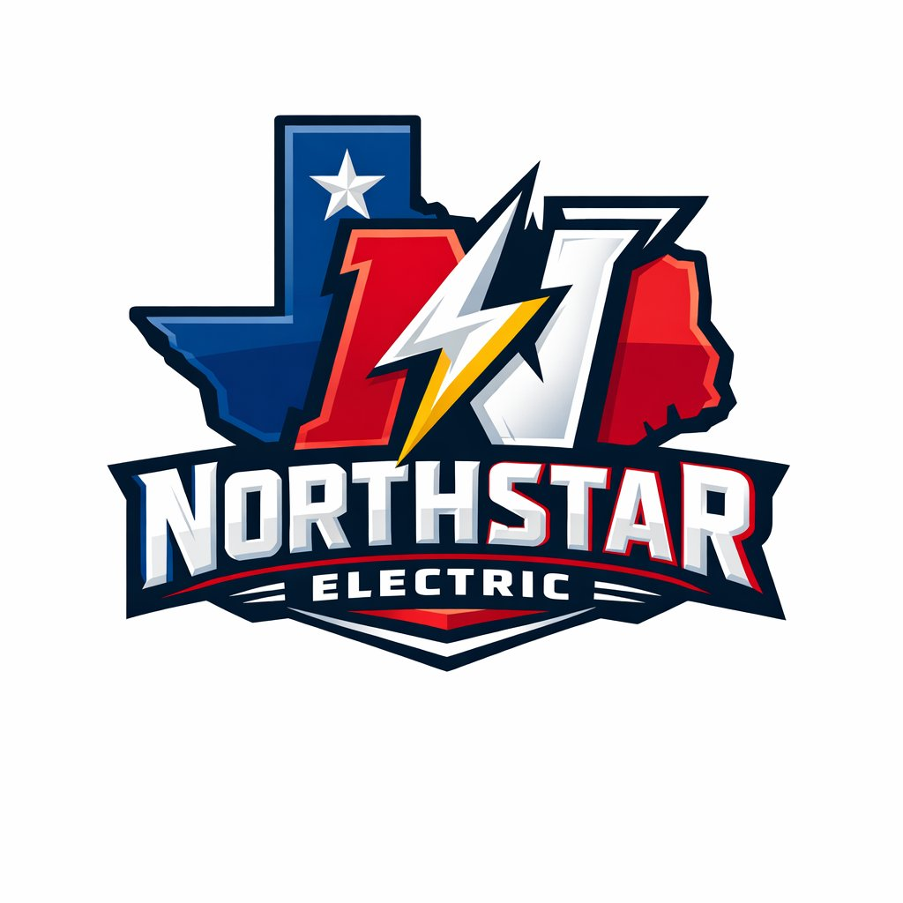

# ⭐ NorthStar Property Management

<p align="center">
  
</p>

<p align="center">
  <strong>Navigate your rental portfolio by the stars — automated, organized, and always on.</strong>
</p>

<p align="center">
  
  
  
  
</p>

---

## What Is This?

**NorthStar Property Management** is a lightweight, self-hosted automation toolkit built for the solo or small-team landlord who is tired of:

- Chasing rent via text message every month
- Digging through email threads to find a lease
- Forgetting when HVAC filters need to change
- Keeping vendor contacts in a phone instead of a system
- Having no idea which property is costing them the most in repairs

This is **not** another $150/month SaaS platform. It runs on your machine, your data stays yours, and it earns its keep from day one.

---

## Core Modules (Low-Hanging Fruit First)

| Module | Pain It Kills | Status |
|---|---|---|
| 🏠 [`tenant/`](src/tenant/) | Tenant contact sheet, lease expiry alerts, move-in/out checklist | ✅ Ready |
| 🔧 [`maintenance/`](src/maintenance/) | Request log, vendor dispatch, status tracking | ✅ Ready |
| 📄 [`leases/`](src/leases/) | Lease inventory, renewal reminders, document index | ✅ Ready |
| 👷 [`vendors/`](src/vendors/) | Vendor roster, preferred contacts, work history | ✅ Ready |
| 📊 [`reports/`](src/reports/) | Monthly summary, cost-per-property, delinquency snapshot | ✅ Ready |
| ⚙️ [`scripts/`](scripts/) | Scheduled automation runners (cron-ready) | ✅ Ready |

---

## Quickstart

```bash
# Clone
git clone https://github.com/your-org/northstar-property-mgmt.git
cd northstar-property-mgmt

# Install
pip install -r requirements.txt

# Configure
cp config.example.env .env
# Edit .env with your SMTP credentials and data paths

# Load your properties and tenants
python scripts/load_initial_data.py

# Run the daily automation check
python scripts/daily_runner.py
```

---

## Automated Alerts You Get Out of the Box

- **Rent due** reminders (3 days before, day of, 3 days after)
- **Lease expiration** warnings (90, 60, 30 days out)
- **Maintenance request** aging alerts (unresolved after 72 hrs)
- **Vendor follow-up** pings (no callback in 24 hrs)
- **Inspection due** reminders (annual or user-defined interval)
- **Filter/seasonal maintenance** calendar items

All alerts are delivered via email (SMTP) or optionally SMS via Twilio. No app to install. Works with Gmail, Outlook, or any SMTP provider.

---

## Project Structure

```
northstar-property-mgmt/
├── src/
│   ├── tenant/          # Tenant registry and communication
│   ├── maintenance/     # Work order lifecycle management
│   ├── leases/          # Lease document index and renewal engine
│   ├── vendors/         # Preferred vendor database
│   ├── reports/         # Monthly and on-demand reporting
│   └── utils/           # Email, SMS, date helpers
├── scripts/             # Cron-ready runners and data loaders
├── data/                # CSV/JSON data files (gitignored)
├── docs/                # SOP documentation
├── tests/               # Unit tests
├── assets/              # Branding
├── config.example.env   # Template config — copy to .env
└── requirements.txt
```

---

## Philosophy

> *"The north star doesn't move. Your systems shouldn't either."*

This toolkit applies the same discipline used to run enterprise platforms serving hundreds of users — availability measurement, change tracking, automated reporting, and root-cause analysis — scaled down to a rental portfolio of any size. When something breaks, you know immediately. When a lease is about to expire, you know 90 days out, not 90 days late.

---

## Configuration

Copy `config.example.env` to `.env` and fill in:

```ini
# Email (required for all alerts)
SMTP_HOST=smtp.gmail.com
SMTP_PORT=587
SMTP_USER=you@gmail.com
SMTP_PASS=your_app_password
ALERT_FROM=alerts@yourdomain.com
OWNER_EMAIL=owner@yourdomain.com

# SMS (optional — requires Twilio free tier)
TWILIO_ACCOUNT_SID=
TWILIO_AUTH_TOKEN=
TWILIO_FROM_NUMBER=

# Data paths
DATA_DIR=./data
```

---

## Scheduling (Cron)

Add this to your crontab (`crontab -e`) to run daily checks at 7 AM:

```
0 7 * * * /usr/bin/python3 /path/to/northstar-property-mgmt/scripts/daily_runner.py >> /var/log/northstar.log 2>&1
```

Monthly report on the 1st at 8 AM:

```
0 8 1 * * /usr/bin/python3 /path/to/northstar-property-mgmt/scripts/monthly_report.py >> /var/log/northstar.log 2>&1
```

---

## Roadmap

- [ ] Web dashboard (Flask, local only)
- [ ] PDF lease generator from template
- [ ] Expense tracker with property-level P&L
- [ ] Twilio two-way tenant SMS
- [ ] Photo log for maintenance requests
- [ ] Export to Excel for accountant/tax prep

---

## Contributing

This is a private tool — fork freely for your own use. PRs welcome if you're a collaborator.

---

## License

MIT — see [LICENSE](LICENSE)

---

<!-- EASTER EGG: If you're reading this in raw markdown, you already know how to navigate by the stars. The real north star is in the code. Try: python -c "import src.utils.stars as s; s.find_north()" -->

> ⭐ *Built for the operator who treats every property like a production system.*
